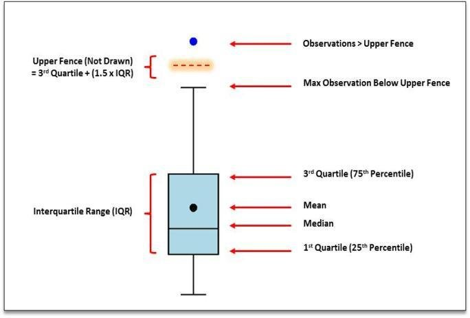

```{r, include=FALSE}
knitr::opts_chunk$set(echo = TRUE)
htmltools::tagList(rmarkdown::html_dependency_font_awesome())
library(reticulate)
suppressMessages(library(dplyr))
suppressMessages(library(kableExtra))
```

```{python include=FALSE}
import os
os.environ['QT_QPA_PLATFORM_PLUGIN_PATH'] = 'C:\Python36\Library\plugins\platforms'
# though you will need to ensure the path is correct for you
```


# Learning Objectives

<input type="checkbox" unchecked>Measures of central tendency</input>  
<input type="checkbox" unchecked>Use cases for mean and median</input>  
<input type="checkbox" unchecked>Measures of dispersion</input>  
<input type="checkbox" unchecked>Calculating standard deviation</input>  
<input type="checkbox" unchecked>Interpretation of inter quartile range</input>  
<input type="checkbox" unchecked>Univariate / bivariate analysis</input>  
<input type="checkbox" unchecked>Interpretation of correlation coefficients</input>  
<input type="checkbox" unchecked>Use of histograms, boxplots, scatter charts & pairplots</input>


***

# Introduction

Statistics is a broadly applied term. For the purposes of this course, we use the term in reference to <strong class="navy">any process undertaken to communicate understanding about a population (of numbers)</strong>. Some widely used, topical and familiar statistics for your consideration:

1. Mean (arithmetic), median, mode, harmonic mean, geometric mean, trimmed mean, <strong class="navy">peri peri mean</strong>
2. Standard deviation, variance, range, interquartile range
3. R number, rates, rates per capita, [indices](https://gov.wales/welsh-index-multiple-deprivation)
4. Service points won in tennis
5. Stock market indices


If data is the raw material, statistics would be the tools used to extract valuable meaning. No tool is perfect, but some are better suited to certain jobs than others.


It can be difficult for most people to take a series of numbers and infer some meaning from their distribution. <strong class="navy">Summary statistics</strong> are often used to help people think more clearly about the distribution of numbers. Summary statistics are sometimes known as descriptive statistics. Whenever we collapse a group of numbers into a single, take-away value, we lose some element of nuance and we need to be aware of this. Summary statistics can be helpful or; intentional or not; misleading.

<span class="quote">"It's easy to lie with statistics, but it's hard to tell the truth without it". <br> <strong>Andrejs Dunkels.</strong> </span>

The Data science Campus' corporate statement is:
<strong class="navy">Data Science for Public Good.</strong>

Therefore, we need to arm ourselves with an intuition and sound understanding of the utility and potential misuse of statistics. 

***


## Exercise 1 <i class="fa fa-question-circle"></i> 

For this exercise we will be using the `sleep` dataset from the `datasets` package in R. You may choose to complete the task either in R or Python below. 

### Sleep data dictionary

<strong class="navy">Description</strong>

Data which show the effect of two soporific drugs (increase in hours of sleep compared to control) on 10 patients.


+------+----------------+--------------------------+
|Column|Data Type (in R)|Description               |
+======+================+==========================+
|1     |Numeric         |increase in hours of sleep|
+------+----------------+--------------------------+
|2     |Factor          |drug given                |
+------+----------------+--------------------------+
|3     |Factor          |patient ID                |
+------+----------------+--------------------------+


```{r include=FALSE}
# R setup chunk
sleep_r <- datasets::sleep
#sleep_py <- r_to_py(sleep_r)
```


```{python include=FALSE}
# python setup chunk
sleep_py = r.sleep_r
# save binary for use in spyder
# pd.to_pickle(sleep_py, "cache/sleep_py.pkl")
```

### Python <i class="fab fa-python"></i> {.tabset .tabset-fade}

Using the `sleep_py` dataframe:

1. import pandas
2. Check the dimensions of the dataframe
3. Check the data types of all columns
4. produce summary statistics on all of its columns.

#### your code 
```{python}
# import pandas
import pandas as pd
# check the dimensions
 
# check the data types

# produce summary statistics for all columns

```


#### hint

```{python eval = FALSE}
# import pandas
import pandas as pd 
# check the dimensions
sleep_py.s...
# check the data types
sleep_py.dt....
# produce summary statistics for all columns
sleep_py.describe()
```

#### solution

```{python}
# import pandas
import pandas as pd
# check the dimensions
sleep_py.size
# check the data types
sleep_py.dtypes
# produce summary statistics for all columns
sleep_py.describe(include="all")
```

### R <i class="far fa-registered"></i> {.tabset .tabset-fade}

Using the `sleep_r` dataframe:

1. Check the dimensions of the dataframe
2. Check the data types of all columns
3. produce summary statistics on all of its columns.


#### your code 
```{r}
# check the dimensions

# check the data types

# produce summary statistics for all columns

```


#### hint

```{r eval = FALSE}
# check the dimensions
d..(sleep_r)
# check the data types
s..(sleep_r)
# produce summary statistics for all columns
su.....(sleep_r)
```

#### solution

```{r}
# check the dimensions
dim(sleep_r)
# check the data types
str(sleep_r)
# produce summary statistics for all columns
summary(sleep_r)
```

###

***

<strong class="navy">Pause for thought</strong> <i class="fa fa-question-circle" id="body"></i> 

Observing the summary statistics of the `extra` column, did you notice any interesting observations? What else would you need to do in order to ascertain whether the treatment had an effect on the typical sleep duration?


# Central Tendency

One of the most commonly employed summary statistics is the <strong class="navy">average</strong>. The average seeks to describe the 'typical' observation, and there are a multitude of averages available. Two of the most important averages are the <strong class="navy">mean</strong> and <strong class="navy">median</strong>.


Both of these averages are measures of central tendency, in that they communicate an aspect of the 'typical' observation of a population. 

As we were all taught in school:

* The mean is the sum of all observations divided by the number of observations. There are slightly adjusted equations for calculating population and sample mean, but that is beyond scope for this topic.

__$$\bar{X} = \frac{\Sigma x}{n}$$__

* If you sorted a group of numbers from smallest to lowest, the median would be the observation in the middle. Exactly half of the observations would be above and below this value. If the number of observations is even, the median value would be exactly halfway between the 2. The equation for calculating the <strong class="navy">position of the median</strong> is lesser known than the mean:

__$$\{(n + 1) ÷ 2\}^{th} value$$__


The mean and median respond differently to the presence of outliers in a population. Let's take a look at a slightly silly context to help build the required intuition.

## Exercise 2a <i class="fa fa-question-circle"></i> 

It's 2019. Ten people were sat at a bar. They were comparing their salaries. Strangely, it turned out that they all earned precisely the [UK median annual income](https://www.statista.com/statistics/1002964/average-full-time-annual-earnings-in-the-uk/).


Using either R or Python, store this information in an appropriate format.


### Python <i class="fab fa-python"></i> {.tabset .tabset-fade}

1. Import numpy
2. Assign the median salary to a named value
3. Create a numpy array of 10 observations, all of median salary
4. Calculate the mean salary for everyone at the bar
5. Calculate the median salary for everyone at the bar

#### your code 
```{python}
# import numpy
import numpy as np
# assign the salary value

# create the numpy array of 10 repeat observations

#calculate mean salary

#calculate median salary

```


#### hint

```{python eval = FALSE}
# import numpy
...... numpy .. np
# assign the salary value
med_salary = .....
# create the numpy array of 10 repeat observations
all_salaries = np.......(med_salary, 10)
#calculate mean salary
np.....(all_salaries)
#calculate median salary
np.......(all_salaries)
```

#### solution

```{python}
# import numpy
import numpy as np
# assign the salary value
med_salary = 30380
# create the numpy array of 10 repeat observations
all_salaries = np.repeat(med_salary, 10)
#calculate mean salary
np.mean(all_salaries)
#calculate median salary
np.median(all_salaries)
```

### R <i class="far fa-registered"></i> {.tabset .tabset-fade}

1. Assign the median salary to a named value
2. Create a numeric vector of 10 observations, all of median salary
3. Calculate the mean salary for everyone at the bar
4. Calculate the median salary for everyone at the bar


#### your code 
```{r}
# assign the salary value

# Create a numeric vector of 10 observations, all of median salary

#calculate mean salary

#calculate median salary


```


#### hint

```{r eval = FALSE}
# assign the salary value
med_salary <- .....
# Create a numeric vector of 10 observations, all of median salary
all_salaries <- ...(med_salary, ..)
#calculate mean salary
....(all_salaries)
#calculate median salary
......(all_salaries)
```

#### solution

```{r}
# assign the salary value
med_salary <- 30380
# Create a numeric vector of 10 observations, all of median salary
all_salaries <- rep(med_salary, 10)
#calculate mean salary
mean(all_salaries)
#calculate median salary
median(all_salaries)
```

###

Nothing interesting so far. Let's continue...

***

## Exercise 2b <i class="fa fa-question-circle"></i> 

A surprise development - Bill Gates enters the bar and takes a seat with the rest of our bar-goers. We'll assume based on [this article](https://www.businessinsider.com/how-rich-is-bill-gates-net-worth-mind-blowing-facts-2019-5?r=US&IR=T#11-according-to-the-social-security-administration-the-average-american-man-with-a-bachelors-degree-will-earn-about-22-million-in-his-lifetime-gates-makes-that-in-a-little-over-an-hour-and-a-half-11) that his earnings for that year was <strong class="navy">12 billion dollars</strong>.


Exchange rate for this calculation is based on [this source](https://www.exchangerates.org.uk/GBP-USD-spot-exchange-rates-history-2019.html), where we will be using the 2019 conversion average of:

1 Pound = 1.2772 USD

1. Convert Bill's earnings into 2019 pounds.
2. Calculate the reciprocal of the exchange rate (as we want to go from USD to GBP, not the other way)
3. Adjust the data you created in exercise 2a to include Bill's earnings.
4. Recalculate the mean.
5. Recalculate the median.


### Python <i class="fab fa-python"></i> {.tabset .tabset-fade}

1. Assign Bill's earnings
2. Find the reciprocal of the given exchange rate
3. Convert Bill's earnings to 2019 pounds
4. Append Bill's earnings in pounds to the numpy array of all the bar patrons' earnings
5. Recalculate the mean salary for everyone at the bar
6. Recalculate the median salary for everyone at the bar

#### your code 
```{python}
# Assign Bill's earnings
bills_salary = 12000000000
# calculate the reciprocal of the given exchange rate

# Convert them to 2019 pounds

# Add Bill's earnings in pounds to the numpy array of all the bar patrons' earnings

# Recalculate the mean salary for everyone at the bar

# Recalculate the median salary for everyone at the bar

```


#### hint

```{python eval = FALSE}
# Assign Bill's earnings
bills_salary = ...........
print(bills_salary)
# calculate the reciprocal of the given exchange rate
xrate = ./......
print(xrate)
# Convert earnings to 2019 pounds
bills_salary_gbp = .*.
print(bills_salary_gbp)
# Add Bill's earnings in pounds to the numpy array of all the bar patrons' earnings
all_salaries = ..append(all_salaries, bills_salary_gbp)
print(all_salaries)
# Recalculate the mean salary for everyone at the bar
.......(all_salaries)
# Recalculate the median salary for everyone at the bar
.........(all_salaries)
```

#### solution

```{python}
# Assign Bill's earnings
bills_salary = 12000000000
print(bills_salary)
# calculate the reciprocal of the given exchange rate
xrate = 1/1.2772
print(xrate)
# Convert them to 2019 pounds
bills_salary_gbp = bills_salary*xrate
print(bills_salary_gbp)
# Add Bill's earnings in pounds to the numpy array of all the bar patrons' earnings
all_salaries = np.append(all_salaries, bills_salary_gbp)
print(all_salaries)
# Recalculate the mean salary for everyone at the bar
np.mean(all_salaries)
# Recalculate the median salary for everyone at the bar
np.median(all_salaries)
```

### R <i class="far fa-registered"></i> {.tabset .tabset-fade}

1. Assign Bill's earnings
2. Find the reciprocal of the given exchange rate
3. Convert Bill's earnings to 2019 pounds
4. Append Bill's earnings in pounds to the numeric vector of all the bar patrons' earnings
5. Recalculate the mean salary for everyone at the bar
6. Recalculate the median salary for everyone at the bar


#### your code 
```{r}
# Assign Bill's earnings

# calculate the reciprocal of the given exchange rate

# Convert Bill's salary to 2019 pounds

# Append Bill's earnings in pounds to the numeric vector of all the bar patrons' earnings

# Recalculate the mean salary for everyone at the bar

# Recalculate the median salary for everyone at the bar


```


#### hint

```{r eval = FALSE}
# Assign Bill's earnings
bills_salary <- ...........
bills_salary
# calculate the reciprocal of the given exchange rate
xrate <-  ./......
xrate
# Convert Bill's salary to 2019 pounds
bills_salary_gbp <- .*.
bills_salary_gbp
# Append Bill's earnings in pounds to the numeric vector of all the bar patrons' earnings
all_salaries <- .(all_salaries, bills_salary_gbp)
all_salaries
# Recalculate the mean salary for everyone at the bar
.(all_salaries)
# Recalculate the median salary for everyone at the bar
.(all_salaries)
```

#### solution

```{r}
# Assign Bill's earnings
bills_salary <- 12000000000
bills_salary
# calculate the reciprocal of the given exchange rate
xrate <- 1/1.2772
xrate
# Convert Bill's salary to 2019 pounds
bills_salary_gbp <- bills_salary * xrate
bills_salary_gbp
# Append Bill's earnings in pounds to the numeric vector of all the bar patrons' earnings
all_salaries <- c(all_salaries, bills_salary_gbp)
all_salaries
# Recalculate the mean salary for everyone at the bar
mean(all_salaries)
# Recalculate the median salary for everyone at the bar
median(all_salaries)
```

###

***

<strong class="navy">Pause for thought</strong> <i class="fa fa-question-circle" id="body"></i> 

Having recalculated the mean and median of everyone at the bar, you should have noticed that the mean had skyrocketed, but that <strong class="navy">the median did not budge</strong>. None of the 10 bar patrons had gotten any richer when Bill joined the group, so in your mind, which is the better representation of the typical bar patron here? The mean or the median?

We could continue to add more of the wealthiest people in the world [according to Wikipedia](https://en.wikipedia.org/wiki/The_World%27s_Billionaires), without affecting the median. <strong class="navy">At which point would the median be affected?</strong>:

* Jeff Bezos
* Bernard Arnault
* Warren Buffett
* Larry Ellison
* Amancio Ortega
* Mark Zuckerberg
* Jim Walton
* Alice Walton
* Robson Walton

Once all of these super-wealthy pub-goers had joined the group at the bar, the median would no longer be the better choice of the two averages to represent the typical person at that bar. But then again, it would not be any old bar! As this would now be a hangout for the super-rich, then use of the mean would be warranted. It would be more representative of the population than the median. Would the super-rich clientele still count as outliers? We will come to the formal definition of outliers later. 

<strong class="navy">Pause for thought</strong> <i class="fa fa-question-circle" id="body"></i> 
Do we know of any ways to define an outlier?


### When the median isn't the message

Take a look at the [British Medical Journal's](https://www.bmj.com/rapid-response/2011/11/03/median-not-message) response to a fantastic [essay](https://www.dancingupsidedown.com/wp-content/uploads/2008/12/MedianNotMessageCancer_Gould.pdf) by the evolutionary biologist, Stephen Jay Gould in 2002.

Dr Gould was diagnosed with a terminal form of cancer in the 1980s and while reading around the subject, discovered that the median survival duration following diagnosis was 8 months. Dr Gould died in 2002 of a different, unrelated form of cancer, having survived thirty times longer than the published median survival period. You can see from the BMJ article that his legacy has been a deeper consideration of medical communication of statistics.

If some significant number of patients with this disease (perhaps 20 or 30 %) go on to live long and relatively healthy lives, that absolutely matters and needs to be communicated to any person diagnosed with that disease. The use of the median here would be the wrong type of average to communicate.


<span class="summary-box">
Appropriate use of the mean or median comes down to judgement. Consideration of the distribution of the population and what any outliers mean for an analysis is crucial. Do the outliers obscure the message, or are the outliers the message?</span>


### Quick and dirty outlier determination.

Whenever you produce summary statistics for a column, you tend to see median and mean. Noticing differences (if any) between these averages can indicate the presence of outliers and in what direction. Let's have a play.


## Exercise 3a

The `ChickWeight` dataset from R's `datasets` package:

<strong class="navy>Weight versus age of chicks on different diets</strong>
<strong class="navy>Description</strong>

The ChickWeight data frame has 578 rows and 4 columns from an experiment on the effect of diet on early growth of chicks.


Type `?ChickWeight` into the R console or an R code chunk for more detail.

<strong class="navy">Please note that Python tends to refer to the median as `50%` in its summary statistics output.</strong>

```{r, include=FALSE}
# prep chunk
# load dataset
chicks_r <- datasets::ChickWeight
```


### Python <i class="fab fa-python"></i> {.tabset .tabset-fade}

#### Your code

Produce summary statistics on the `weight` column in the `chicks_py` dataframe.

```{python}
chicks_py = r.chicks_r
# save binary for use in spyder
# pd.to_pickle(chicks_py, "cache/chicks_py.pkl")
# summary stats on weight column


```

<strong class="navy">Pause for thought</strong> <i class="fa fa-question-circle" id="body"></i>

What do you notice about the mean and median? What does this mean in terms of any outliers within this column's values?

<!-- TODO --JM the above question could be answered in the example solution which would help with self learning -->

You can confirm any suspicions here in a number of ways. Typically you would get frequencies of the column values. You can also visualise these frequencies in a variety of ways.

Plot a histogram of the `weight` column, specifying 20 bins / breaks. Note that `matplotlib` is used in the hints and solution, but you may use whatever plotting package you prefer. Feel free to make it look jazzy if you have time at the end of exercise 3 (it has 3 parts).

```{python}
# plot histogram
import matplotlib.pyplot as plt

```


#### Hint

Produce summary statistics on the `weight` column in the `chicks_py` dataframe.

```{python eval=FALSE}
chicks_py = r.chicks_r
# summary stats on weight column
chicks_py...............()
```

<strong class="navy">Pause for thought</strong> <i class="fa fa-question-circle" id="body"></i>

What do you notice about the mean and median? What does this mean in terms of any outliers within this column's values?

You can confirm any suspicions here in a number of ways. Typically you would get frequencies of the column values. You can also visualise these frequencies in a variety of ways.

Plot a histogram of the `weight` column, specifying 20 bins / breaks. Note that `matplotlib` is used in the hints and solution, but you may use whatever plotting package you prefer. Feel free to make it look jazzy if you have time at the end of exercise 3 (it has 3 parts).

```{python eval=FALSE}
# plot histogram
import matplotlib.pyplot as plt
histogram = plt.....(............., ....=20)
plt.....(.)
```


#### Solution

Produce summary statistics on the `weight` column in the `chicks_py` dataframe.

```{python}
chicks_py = r.chicks_r
# summary stats on weight column
chicks_py.weight.describe()
```

<strong class="navy">Pause for thought</strong> <i class="fa fa-question-circle" id="body"></i>

What do you notice about the mean and median? What does this mean in terms of any outliers within this column's values?

You can confirm any suspicions here in a number of ways. Typically you would get frequencies of the column values. You can also visualise these frequencies in a variety of ways.

Plot a histogram of the `weight` column, specifying 20 bins / breaks. Note that `matplotlib` is used in the hints and solution, but you may use whatever plotting package you prefer. Feel free to make it look jazzy if you have time at the end of exercise 3 (it has 3 parts).

```{python}
# plot histogram
import matplotlib.pyplot as plt
histogram = plt.hist(chicks_py.weight, bins=20)
plt.show(histogram)
```


***

### R <i class="far fa-registered"></i> {.tabset .tabset-fade}

#### Your code

Produce summary statistics on the `weight` column in the `chicks_r` dataframe.

```{r}
# summary stats on weight column

```

<strong class="navy">Pause for thought</strong> <i class="fa fa-question-circle" id="body"></i>

What do you notice about the mean and median? What does this mean in terms of any outliers within this columns' values?

You can confirm any suspicions here in a number of ways. Typically you would get frequencies of the column values. You can also visualise these frequencies in a variety of ways.

Plot a histogram of the `weight` column, specifying 20 bins / breaks. Note that base R is used in the hints and solution, but you may use whatever plotting package you prefer. Feel free to make it look jazzy if you have time at the end of exercise 3 (it has 3 parts).

```{r}
# plot histogram

```

#### Hint

Produce summary statistics on the `weight` column in the `chicks_r` dataframe.

```{r eval=FALSE}
.......(chicks_r$weight)
```

<strong class="navy">Pause for thought</strong> <i class="fa fa-question-circle" id="body"></i>

What do you notice about the mean and median? What does this mean in terms of any outliers within this columns' values?

You can confirm any suspicions here in a number of ways. Typically you would get frequencies of the column values. You can also visualise these frequencies in a variety of ways.

Plot a histogram of the `weight` column, specifying 20 bins / breaks. Note that base R is used in the hints and solution, but you may use whatever plotting package you prefer. Feel free to make it look jazzy if you have time at the end of exercise 3 (it has 3 parts).

```{r eval=FALSE}

hist(chicks_r$weight, ...... = 20)

```


#### Solution

Produce summary statistics on the `weight` column in the `chicks_r` dataframe.

```{r}
summary(chicks_r$weight)
```

<strong class="navy">Pause for thought</strong> <i class="fa fa-question-circle" id="body"></i>

What do you notice about the mean and median? What does this mean in terms of any outliers within this columns' values?

You can confirm any suspicions here in a number of ways. Typically you would get frequencies of the column values. You can also visualise these frequencies in a variety of ways.

Plot a histogram of the `weight` column, specifying 20 bins / breaks. Note that base R is used in the hints and solution, but you may use whatever plotting package you prefer. Feel free to make it look jazzy if you have time at the end of exercise 3 (it has 3 parts).

```{r}

hist(chicks_r$weight, breaks = 20)

```


***

## Exercise 3b

```{r include=FALSE}
#prep code chunk
lake_r <- datasets::LakeHuron
```

For this exercise, we shall use the `LakeHuron` dataset from R's `datasets` package. The data type is a time-series object, which for our purposes you can treat exactly like a numeric vector. Lake Huron is in Michigan, USA.

<!-- TODO --JM For this and other data sets in the course it may be useful to show with Kable what the data set looks like to help get a better feel for the values and data types of each column -->

<strong class="navy">Level of Lake Huron 1875–1972</strong>

<strong class="navy">Description</strong>
Annual measurements of the level, in feet, of Lake Huron 1875–1972.  

<strong class="navy">Format</strong>
A time series of length 98.


### Python <i class="fab fa-python"></i> {.tabset .tabset-fade}

#### Your Code

Produce a summary of the lake levels time series

<!-- TODO --JM Instead of working between R and python for the R data sets could the data be exported to a csv outside of the course and just loaded with either R or python, not an important change though -->

```{python}
lake_py = r.lake_r
# convert to binary for use in spyder
# pd.to_pickle(lake_py, "cache/lake_py.pkl")
# Convert to a pandas series

#produce summary statistics of the lake levels

```

<strong class="navy">Pause for thought</strong> <i class="fa fa-question-circle" id="body"></i> 

Observe the mean and median. How do you think the distribution looks?

Plot the distribution with a histogram, specifying the default number of bins.

```{python}
# need to have 1 executable line to avoid error...
import matplotlib.pyplot as plt
# draw a histogram with default number of bins

```


#### Hint

Produce a summary of the lake levels time series

```{python eval=FALSE}
lake_py = r.lake_r
# Convert to a pandas series
lake_py = .........(lake_py)
#produce summary statistics of the lake levels
lake_py..........()
```

<strong class="navy">Pause for thought</strong> <i class="fa fa-question-circle" id="body"></i> 

Observe the mean and median. How do you think the distribution looks?

Plot the distribution with a histogram, specifying the default number of bins.

```{python eval=FALSE}
import matplotlib.pyplot as plt
# draw a histogram with default number of bins
histogram = ........(lake_py)
plt.....(histogram)
```

#### Solution

Produce a summary of the lake levels time series

```{python}
lake_py = r.lake_r
# Convert to a pandas series
lake_py = pd.Series(lake_py)
# produce summary statistics of the lake levels
lake_py.describe()
```

<strong class="navy">Pause for thought</strong> <i class="fa fa-question-circle" id="body"></i> 

Observe the mean and median. How do you think the distribution looks?

Plot the distribution with a histogram, specifying the default number of bins.

```{python}
import matplotlib.pyplot as plt
# draw a histogram with default number of bins
histogram = plt.hist(lake_py)
plt.show(histogram)
```


### R <i class="far fa-registered"></i> {.tabset .tabset-fade}

#### Your Code

Produce a summary of the lake levels time series

```{r}
# produce summary statistics of the lake levels


```

<strong class="navy">Pause for thought</strong> <i class="fa fa-question-circle" id="body"></i> 

Observe the mean and median. How do you think the distribution looks?

Plot the distribution with a histogram, specifying the default number of bins.

```{r}
# draw a histogram with default number of bins

```


#### Hint

Produce a summary of the lake levels time series

```{r eval=FALSE}
# produce summary statistics of the lake levels
.......(lake_r)

```

<strong class="navy">Pause for thought</strong> <i class="fa fa-question-circle" id="body"></i> 

Observe the mean and median. How do you think the distribution looks?

Plot the distribution with a histogram, specifying the default number of bins.

```{r eval=FALSE}
# draw a histogram with default number of bins
....(lake_r)
```

#### Solution

Produce a summary of the lake levels time series

```{r}
# produce summary statistics of the lake levels
summary(lake_r)

```

<strong class="navy">Pause for thought</strong> <i class="fa fa-question-circle" id="body"></i> 

Observe the mean and median. How do you think the distribution looks?

Plot the distribution with a histogram, specifying the default number of bins.

```{r}
# draw a histogram with default number of bins
hist(lake_r)
```


***

## Exercise 3c
```{r include=FALSE}
#prep code chunk
rivers_r <- datasets::rivers
```
<strong class="navy">Lengths of Major North American Rivers</strong>

<strong class="navy">Description</strong>

<!-- TODO --JM Same as for previous exercises it would be useful to add in the explaination in the answer of the qualitive / non-code parts of the questions. -->

This data set gives the lengths (in miles) of 141 “major” rivers in North America, as compiled by the US Geological Survey.

<strong class="navy">Format</strong>

A vector containing 141 observations.


### Python <i class="fab fa-python"></i> {.tabset .tabset-fade}

#### Your Code

Produce summary statistics on the `rivers_py` data.

```{python}
#convert from r data
rivers_py = r.rivers_r
# convert to binary for use in spyder
# pd.to_pickle(rivers_py, "cache/rivers_py.pkl")
# convert to pandas series


# produce summary statistics on the data

```

<strong class="navy">Pause for thought</strong> <i class="fa fa-question-circle" id="body"></i>

Observing the median and the mean, do you believe there to be outliers present? At what end of the river lengths would you expect them?

plot a histogram specifying 6 bins.


```{python}
# need one executable line to avoid error...
import matplotlib.pyplot as plt
# plot a histogram

```

#### Hint

Produce summary statistics on the `rivers_py` data.

```{python eval=FALSE}
#convert from r data
rivers_py = r.rivers_r
# convert to pandas series
rivers_py = .........(rivers_py)

# produce summary statistics on the data
rivers_py.........()
```

<strong class="navy">Pause for thought</strong> <i class="fa fa-question-circle" id="body"></i>

Observing the median and the mean, do you believe there to be outliers present? At what end of the river lengths would you expect them?

plot a histogram specifying 6 bins.


```{python eval=FALSE}
# need one executable line to avoid error...
import matplotlib.pyplot as plt
# plot a histogram
histogram = ........(rivers_py, ....=.)
plt.....(histogram)
```


#### Solution

Produce summary statistics on the `rivers_py` data.

```{python}
#convert from r data
rivers_py = r.rivers_r
# convert to pandas series
rivers_py = pd.Series(rivers_py)

# produce summary statistics on the data
rivers_py.describe()
```

<strong class="navy">Pause for thought</strong> <i class="fa fa-question-circle" id="body"></i>

Observing the median and the mean, do you believe there to be outliers present? At what end of the river lengths would you expect them?

plot a histogram specifying 6 bins.


```{python}
# need one executable line to avoid error...
import matplotlib.pyplot as plt
# plot a histogram
histogram = plt.hist(rivers_py, bins=6)
plt.show(histogram)
```


### R <i class="far fa-registered"></i> {.tabset .tabset-fade}

#### Your Code

Produce summary statistics on the `rivers_r` data.

```{r}
# produce summary statistics on the data

```

<strong class="navy">Pause for thought</strong> <i class="fa fa-question-circle" id="body"></i>

Observing the median and the mean, do you believe there to be outliers present? At what end of the river lengths would you expect them?

plot a histogram specifying 6 bins.


```{r}
#plot a histogram

```

#### Hint

Produce summary statistics on the `rivers_r` data.

```{r eval=FALSE}
# produce summary statistics on the data
.......(rivers_r)
```

<strong class="navy">Pause for thought</strong> <i class="fa fa-question-circle" id="body"></i>

Observing the median and the mean, do you believe there to be outliers present? At what end of the river lengths would you expect them?

plot a histogram specifying 6 bins.


```{r eval=FALSE}
#plot a histogram
....(rivers_r, ...... = .)
```

#### Solution

Produce summary statistics on the `rivers_r` data.

```{r}
# produce summary statistics on the data
summary(rivers_r)
```

<strong class="navy">Pause for thought</strong> <i class="fa fa-question-circle" id="body"></i>

Observing the median and the mean, do you believe there to be outliers present? At what end of the river lengths would you expect them?

plot a histogram specifying 6 bins.


```{r}
#plot a histogram
hist(rivers_r, breaks = 6)
```

###

# Variation

Another crucial feature of any group of numbers that we need to conceptualise is the dispersal of the numbers around the middle. Meaning, how spread out are the numbers, are they clustered or evenly distributed? There are a number of descriptive statistics available to us in order to explore this aspect of any numerical data:

* Range
* Inter Quartile Range (IQR)
* Variance
* Standard Deviation.


## Univariate Analysis

Univariate analysis considers one variable in isolation. We can employ all of the dispersal statistics mentioned above for univariate analysis. 

* **Range** is quite straight forward as I'm sure you know. Simply the maximum observed value minus the minimum observed value. Combined with an awareness of the median, this can give you an indication of skew in any population. Is the median closer to the maximum or minimum? This indicates where observations may be clustered.

## Standard Deviation

Standard deviation is a measure of dispersal around the mean. As it references the mean, it can be influenced by the presence of outliers, so please pay attention to that. Standard deviation can be a particularly powerful statistic, especially when the data has been assessed to conform to a <strong class="navy">normal</strong> or <strong class="navy">parametric</strong> distribution.


In this way, it's possible to use the standard deviation to classify outliers, for example any value beyond 3 standard deviations away from the mean is likely to be an outlier. There may be certain conditions where this does not work well, particularly if outliers of similar magnitude exist at both upper and lower extremes of the variable. This can have the net effect of increasing the value of the standard deviation also. Again, there is no 'one size fits all' method of operating. Knowing your data and the nature of its distribution must take precedence.

Standard deviation is closely related to the variance, which we will briefly consider. The advantage that S.D. has over the variance is that S.D. is in the units of the variable being analysed. This makes it more intuitive to use than the variance, which is in the variable units to the power of 2.

Despite its utility, the standard deviation is poorly understood and often not taught at high school unless the student happens to select a numerate subject. And if it is not taught well at that point, then Universities will tend to assume it as prior knowledge and not teach it either. In an attempt to rectify these shortcomings, we should consider its formula and then apply it to a case study.

<Strong class="navy">Sample Standard Deviation Formula.</strong>

$$\sigma = \sqrt{\frac{\Sigma (x_i - \mu)^2}{n - 1}}$$

Where...
$\sigma$ =	population standard deviation
$n$	=	the sample size
$x_i$	=	each value from the population
$\mu$	=	the population mean

Let's deconstruct this formula to gain a better understanding. To help us with this process, let's look at a dataset too. Here we will be using the `women` dataset from R's `datasets` package.


<strong class="navy">Average Heights and Weights for American Women</strong>

<strong class="navy">Description</strong>
This data set gives the average heights and weights for American women aged 30–39.


<strong class="navy">Format</strong>
A data frame with 15 observations on 2 variables.

<strong class="navy">height</strong> numeric	Height (in)
<strong class="navy">weight</strong> numeric	Weight (lbs)

For simplicity, let's just look at the weight column.

```{r echo=FALSE}
w_weights <- women %>% 
  select(weight)

w_weights %>% 
  kable() %>% 
  kable_styling()
  

```


<strong class="navy">Step 1</strong>
$x_i - \mu$

For every observation in a column, we can subtract the mean value. This gives us the differences to the mean. Seems pretty useful.

```{r echo=FALSE}
w_weights <- w_weights %>% 
  mutate("x-mu" = weight - mean(weight))

w_weights %>% 
  kable() %>% 
  kable_styling()

```

Useful but not perfect. We want <strong class="navy">one</strong> number, not 15. But if we summed them all now, the negative values would likely cancel out the positive values. Let's square the values to get rid of those pesky negatives.

<strong class="navy">Step 2</strong>
$(x_i - \mu)^2$
Squaring the residuals from the mean, calculated in step one will ensure all values are positive. This will ensure that we can sum these values to a meaningful number.

```{r echo=FALSE}
w_weights <- w_weights %>%
  mutate("x-mu^2" = `x-mu`**2)

w_weights %>% 
  kable() %>% 
  kable_styling()

```


<strong class="navy">Step 3</strong>
$\Sigma (x_i - \mu)^2$

``` {r echo=FALSE}

paste("The sum of the squared residuals is", (sumsquar <- sum(w_weights$`x-mu^2`)))

```

Great. But now we have a new problem... The more data we have, the larger our number would be. That's not good if we want to be able to compare a statistic across different-sized samples.

<strong class="navy">Step 4</strong>
$\frac{\Sigma (x_i - \mu)^2}{n - 1}$

This bit loses some people, so let's lean into it. Forget about the minus 1 for now. We're dividing by the number of observations in the column. That is going to correct our statistic for the number of observations. Therefore really large datasets can have a comparable value to smaller ones.

The minus 1 bit... That's specific to the sample SD. If you could ensure that you have recorded the entire population, you wouldn't bother to subtract minus 1. There is likely to be a bit more variability in an entire population than in a sample. So, in estimating the SD we should nudge the value up a bit. And we should do this all the more when the sample is smaller, the likelihood that the entire range of values sampled has diminished by having fewer observations.

In subtracting 1 from **n**, we ensure that we correct proportionately more for smaller samples than larger ones. Don't let this nuance distract from the main purpose of this step though, that is to correct for varying observation sizes.

<!-- --JM love this explaination, wish I'd had it years ago! -->


``` {r echo=FALSE}

paste("n - 1 for this dataset is", (`n-1` <- length(w_weights$`x-mu-squared`) - 1))

paste("The outcome of this step calculation is", (variance <- sumsquar / `n-1`))

```

This value is known as the <strong class="navy">variance</strong>. The units are 240.21 $lbs^2$. It's not very intuitive to think in squared units and the only reason this is the case was because back in step 2, we squared the residuals. We can now undo that step by finding the square root of this number and returning the units to the far more intelligible *lbs*.

<strong class="navy">Step 5</strong>
$\sigma = \sqrt{\frac{\Sigma (x_i - \mu)^2}{n - 1}}$
Putting it all together.

```{r echo=FALSE}
paste("The Standard Deviation is", round(sqrt(variance), digits = 2), "lbs")

```

This would mean that if the data were normally distributed, 68% of the observations would fall within the value range of 15.5lbs either side of the mean value. Furthermore, we could also go on to find observations that lie more than 3 standard deviations away from the mean and label them as outliers. Though we should also add caution that we are dealing with a tiny sample of 15 observations here, for simplicity's sake.

*** 

## Inter Quartile Range

The median is often described as the 'mid quartile' or 'inter-quartile in that it is the value that divides the number of observations in half. 50% of the observations will be above and below this value. the quartiles are a similar concept but used to divide the data into quarters instead. Take a look at the image below:


The vector of numbers can be neatly divided into groups of 3. The <strong class="navy">First Quartile</strong> is the <strong class="navy">value</strong> that establishes the boundary between the lowest quarters of the observed data values. Similarly, the <strong class="navy">Third Quartile</strong> separates the upper quarters of the data values.

Put simply, 25% of the observations would fall above the third quartile. 75 % of the observations would lie below it. 

<!-- TODO --JM consider adding a brief mention of the difference in this area around discrete vs continuous variables -->

Coming back to the interquartile range, this is simply subtracting the value of Q1 from Q3.

$IQR = Q_3 - Q_1$

<!-- TODO --JM If bimodal is being mentioned it would be useful to briefly explain or link to what it means -->

The <strong class = "navy">IQR</strong> tells us where the central 50% of the data lies. If the IQR is large, the data could be widely distributed (or even bimodal, though out of scope for this course). The IQR is also a useful tool for defining outliers, which we will come to look at later.

<span class="summary-box">As IQR is based on quartiles, it is not so easily affected by outlier values. Just like the median. This is in direct contrast to the standard deviation, which uses the mean. Therefore, a full and sound assessment of what the outliers mean for your analysis should be carefully considered when deciding whether to use IQR or standard deviation in explaining variation in your data.</span>

## Using Boxplots

Sometimes these are referred to as box and whiskers plot. They're useful to quickly assess the distribution of a single variable, just like histograms. Unlike histograms, they explicitly declare the position of the quartiles, allowing you to assess the distribution, the first question being, is the median line positioned in the centre of the box? Histograms, however, have the advantage of declaring the frequency of the observations (in a grouped, discretized format) which boxplots do not. Note the labelling on the following diagram.



The middle 50% of the observations will be shown within the box, the median being represented as a line. Sometimes the mean may also appear. The end of the whiskers represents the minimum and maximum observations <strong class="navy">disregarding any outliers</strong>.

<strong class="navy">Pause for thought</strong> <i class="fa fa-question-circle" id="body"></i> 

Can you think of a crucial weakness of a basic boxplot?

## Exercise 4a

Let's go back to our sleep data, stored as `sleep_r` or `sleep_py`. Recall that the `extra` column recorded the increase in hours of sleep in comparison to a control group.

Create a boxplot for the extra column

### Python <i class="fab fa-python"></i> {.tabset .tabset-fade}

#### Your Code

```{python}
# need an executable line to avoid error...
import matplotlib.pyplot as plt
# create a boxplot object

# Add a suitable y axis label

# show the boxplot

```

#### Hint

```{python eval=FALSE}

# need an executable line to avoid error...
import matplotlib.pyplot as plt
# create a boxplot object
box = ............(..............)
# Add a suitable y axis label
plt.ylabel(...)
# show the boxplot
........(box)

```

#### Solution

<!-- --JM I have changed references to columns using .column in python in favour of ["column"] -->

```{python}

# need an executable line to avoid error...
import matplotlib.pyplot as plt
# create a boxplot object
box = plt.boxplot(sleep_py["extra"])
# Add a suitable y axis label
plt.ylabel("Additional hours sleep against control")
# show the boxplot
plt.show(box)
```

### R <i class="far fa-registered"></i> {.tabset .tabset-fade}

#### Your Code

```{r}
# create a base boxplot of the extra column

        #specify a suitable y axis
        

```


#### Hint

```{r eval=FALSE}
# create a base boxplot of the extra column
boxplot(.......$.....,
        #specify a suitable y axis
        ylab = ...)
```

#### Solution

```{r}
# create a base boxplot of the extra column
boxplot(sleep_r$extra,
        #specify a suitable y axis
        ylab = "Additional hours sleep against control group")

```


###

<strong class="navy">Pause for thought</strong> <i class="fa fa-question-circle" id="body"></i> 

What can we infer from the boxplot that we created?


In reading around the documentation for data, it can be seen that there are 2 drugs used within this trial. Identified by the `group` column as either drug `1` or `2`. In our boxplots, the distributions of the 2 distinct groups may be interfering and ought to be plotted distinctly. 


