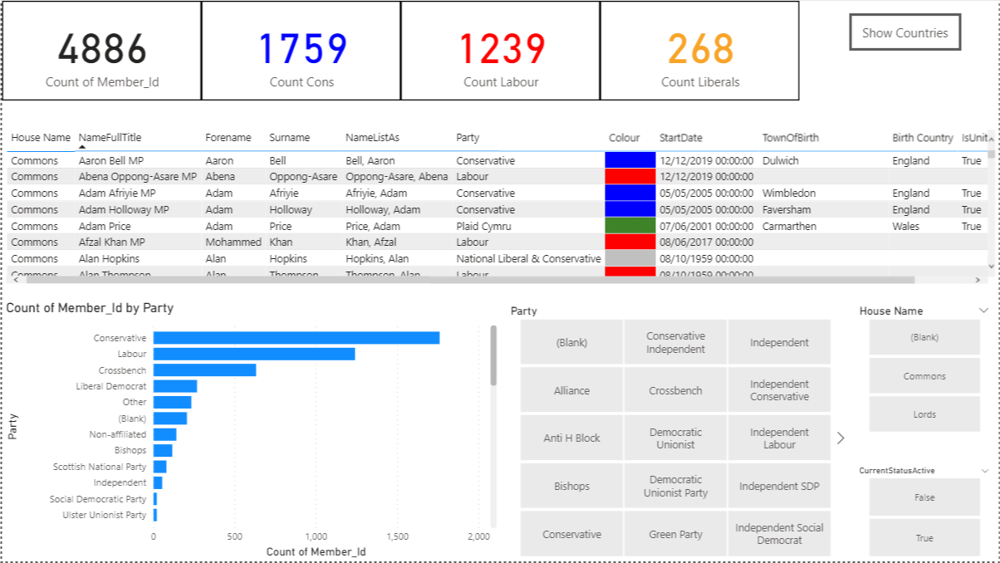
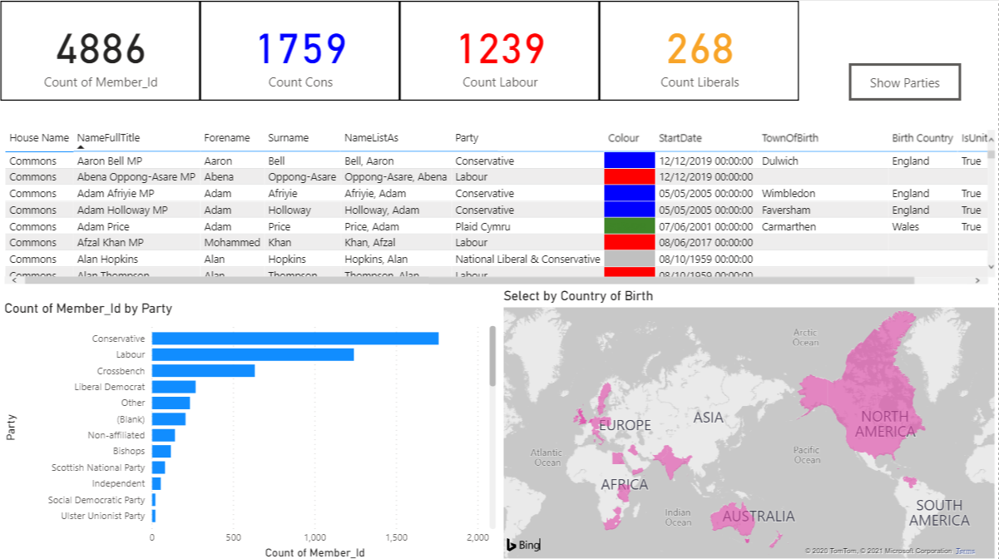

# 2. Advanced Dashboard Help

To do this, you will need to be familiar with:

- All content in the basic task
- OData feeds
- Relational database modelling
- Conditional formatting
- Card measures with basic DAX
- Dashboard design - bookmarks, action buttons.

Please use the guidance below to help you create the report. You can also access the solution and view the query
steps under 'transform data` to assist you.

### Reference materials:

* [UK Parliament api documentation](http://data.parliament.uk/membersdataplatform/open.aspx)
* Odata endpoint: http://data.parliament.uk/membersdataplatform/open/OData.svc
* [Conditional formatting table fields on hex colours.](https://docs.microsoft.com/en-us/power-bi/create-reports/desktop-conditional-table-formatting)

### Instructions

In this report, we will create a report with one page. The user will be able to toggle between 2 views.

#### View 1

In this view, the user can see a table of all listed parliament members with various informative fields.
There are cards with counts of members belonging to specified parties. A bar chart showing counts of parliamentary
members by party affiliation is also displayed. 

Specific to view 1, you will see a group of slicers allowing the users to select from all listed parties, whether
the parliamentary member has an active status, or whether the member is listed as a member of the house of
commons or lords.

#### View 2

View 2 also shows the cards, table and bar chart as in view one. However, instead of the slicers, this view will
display a map of the parliamentary members' birth countries.

#### Notes

* The selections you make on one page **should carry over** to the next page selected.
* The buttons used to navigate can be made to disappear / appear as required.

#### Additional material

* Can you create a button that resets all user-selected filters? This helps users to wipe the slate clean.
* Can you create cards that remind the user which selections they have made? (sometimes referred to as a 'breadcrumbs trail).

### Guide

1. Importing the data.

- paste the endpoint into the required field under `Get data` > `Odata`.
- Select the following tables (but feel free to experiment with the others, too):

* Members
* Countries
* Houses
* Parties
* MemberParties

2. Cleaning the data

Not much is required with this data. To achieve conditional formatting of party colours within the table, you
will need to adjust the Colour column of the Parties table. Please see the [PBI guidance](https://docs.microsoft.com/en-us/power-bi/create-reports/desktop-conditional-table-formatting)
on what needs to be done to achieve that. 

3. Creating View 1.

- Check the data model to ensure that all tables have active relationships. Adjust as needed.
- Create a table with the following fields:

* 'Houses'[Name]
* 'Members'[NameFullTitle]
* 'Members'[Forename]
* 'Members'[Surname]
* 'Members'[Party]
* 'Parties'[Colour]
* 'Members'[StartDate]
* 'Members'[TownOfBirth]
* 'Countries'[Name] -> rename as 'Birth Country'
* 'Countries'[IsUnitedKingdom]

- Apply conditional formatting to the 'Parties'[Colour] column, based on its field value.
- Create the bar chart, counting member_id by party.
- Create the required slicers.
- Produce the cards required. The party specific ones need you to use DAX measures. Hint:

`FILTER()` can be used to filter a table on conditional statements. 
`COUNTROWS()` can then be used to get the number you need for display in a card.
- Create the 2 buttons used to navigate between views.

4. Create View 2.

- Create 2 new bookmarks in the `Bookmarks` pane (found under the `View` menu).
- Ensure the `data` option is unchecked - find this in the ellipsis next to each bookmark.
- Open up `View` > `Selection`.
- Ensure the slicers are hidden for bookmark 2. Remember to update the bookmark before navigating away.
- Create the map. Then remember to hide it in bookmark 1. Always remember to update the bookmark in the state
that you want it.
- Can you figure out how to show/hide the navigation buttons as required?