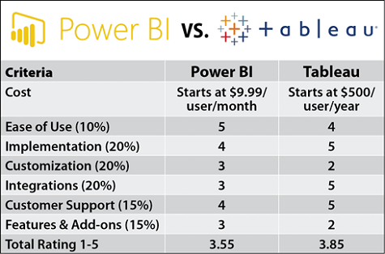
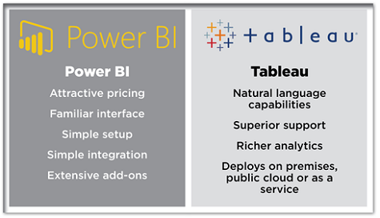
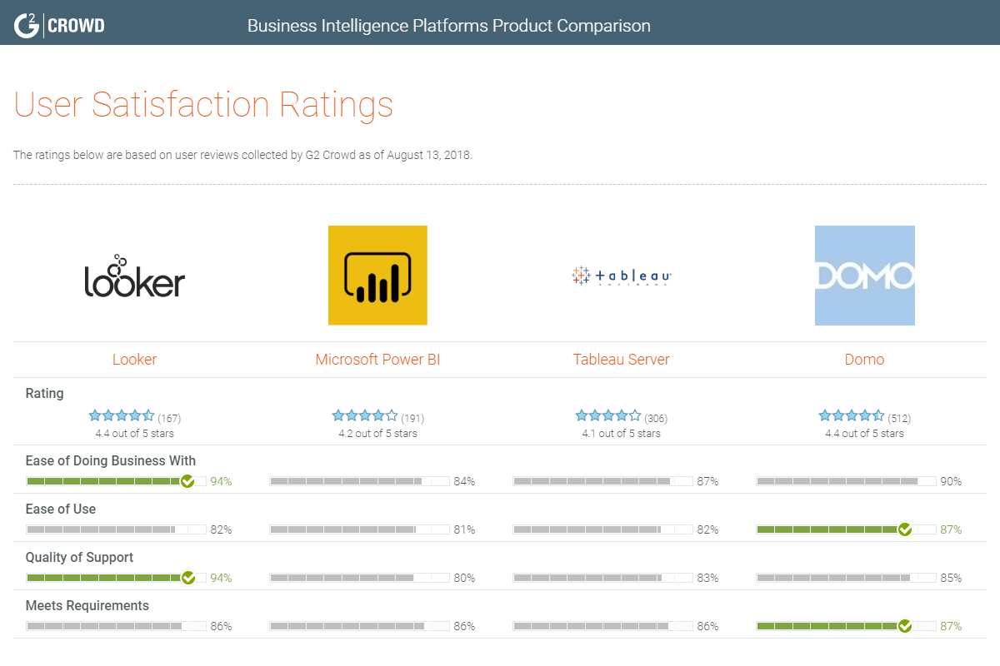
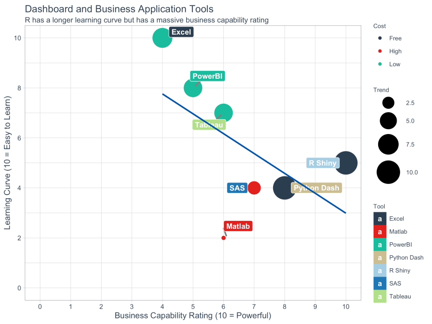

 

## Learning Objectives {-}

The aim of this course is for participants to:

* The use case analysis for using BI software.
* How to import data from different sources.
* Simple cleaning & data manipulation techniques.
* Basic relational data modelling.
* Report design.

The aim is to provide you with just enough guidance to begin exploring how to efficiently create reports.

## Target Audience {-}

This course is designed for those with a basic or limited understanding of business insight software.

## Introduction

**Course Duration:** 2.5 to 3 Hours.

**Agenda:** 

- Slido survey and discussion. (~ 5 mins)
- Use case analysis. (~ 10 mins)
- Tour of Power BI, including: (~ 30 mins)

<input type="checkbox" unchecked>importing local data</input>  
<input type="checkbox" unchecked>basic power query</input>  
<input type="checkbox" unchecked>aggregation behaviour</input>  
<input type="checkbox" unchecked>creating visuals</input>  
<input type="checkbox" unchecked>edit interactions</input>  

- <strong>Exercise 1 - basic dashboard.</strong> (~ 20 mins)
- Building a data model in PBI, including: (~20 mins)

<input type="checkbox" unchecked>OData feeds</input>  
<input type="checkbox" unchecked>Relational database modelling</input>  
<input type="checkbox" unchecked>Conditional formatting</input>  
<input type="checkbox" unchecked>Card measures with basic DAX</input>  
<input type="checkbox" unchecked>Dashboard design - bookmarks, action buttons.</input>

- <strong>Exercise 2 - Advanced dashboards</strong> (~30 mins)

- Python & R integration. (~10 mins)

R integration is pending.

- Hints & Tips. (~5 mins)

- Questions / reflections. (~5 mins)

**Breaks will be included in task duration due to short course duration.**

## Use Case Analysis

Please use the Slido and the included images in this section as a source for debate. Bias warning - promotional materials used here to inform debate.

Would you agree with all of the rating comparisons?
Are there any important comparisons that are missing?

Obviously, the above is promotional material. Note that I can't say from the website whether a user is a person who create or consumes the report.

Does a good job of looking more impartial, but opinionated and R-centric in my own opinion.Interesting article, I recommend reading for a take on the current dashboarding landscape.

It may also be useful to consider where you would place some of the above software, or any familiar analytical software on the reproducibility spectrum above.

### In Review

Consider the following for your project:

* Does your analysis need a dashboard?
* How data literate are your audience?
* Consider your project team. Where are their strengths and what solution presents the quickest path to the required product?
* Accessibility and quality assurance.
* Cost incurred for use case?

## Hints & Tips.

* [SQLBI Dax Formatter](https://www.daxformatter.com/)
* Enter data
* Measures table
* Tips for troubleshooting issues with dashboards
* [Querying apis example.](https://geoportal.statistics.gov.uk/datasets/fe6bcee87d95476abc84e194fe088abb_0)

## Power BI Pro Pilot
