<hr class="hr"> 


```{r setup, include=FALSE}
knitr::opts_chunk$set(echo = TRUE)

```


```{r, echo=FALSE}
htmltools::img(src = knitr::image_uri("../www/AF_DSC_logo.png"),
               alt = 'Learning Academy, Analysis Function and Data Science Campus Logos', 
               align = "centre",
               width = 350)
```

<hr class="hr">

<p class="center">Course Release: `r format(Sys.Date(), "%b %Y")`</p> 
<p class="center">[Need help? Contact the team.](mailto:Data.Science.Campus.Faculty@ons.gov.uk)</p>


## Introduction


This document's purpose is a rough guide to quickly orient a trainee to the principles of data feminism that challenge establish best practice for data visualisation. It will not give an adequate treatment for the rationale for doing so and it is recommended to consult the [suggested reading](#sugread) for the required context. This document is not intended to replace / refute the GSS best practice for data visualisation or any corporate style guide. We present the concepts here as an important discussion to be had and to encourage you to explore the concepts being argued.   

Data feminism is not a movement restricted to women and considers the often under-represented perspectives of people who have traditionally been disadvantaged by structural hierarchies.

This document relies completely on the work of Catherine D'Ignazio and Lauren Klein and directly quotes from their publications throughout.

<hr class="hr"> 

## Suggested Reading {#sugread}


Both of the following texts are available open source online.

[Feminist Data Visualisation, D'Ignazio & Klein, 18.05.21](http://www.kanarinka.com/wp-content/uploads/2015/07/IEEE_Feminist_Data_Visualization.pdf)  

[Data feminism](https://data-feminism.mitpress.mit.edu/)

<hr class="hr"> 

<a id="6princ"></a>

## Six Principles for DataViz {.tabset}

All principles may not apply to all visualisations. The **Design Process** and **Design Output** questions are all directly quoted from Feminist Data Visualisation paper, linked in the [suggested reading](#sugread)

### 1. Binaries.

**Rethink binaries**: Male/female, nature/culture, subject/object, reason/emotion, body/world, among others. Emphasise multiplicity. Acknowledge limits of binaries. Challenge yourself to rethink how binaries could be alternatively represented and implications for data collection, classification through to visualisation.

#### Design Process Questions:

* "Is our data the right type?
* What categories have we taken for granted?
* How can we register responses that do not fit into the categories we have provided, even and especially if they are “edge cases” and “outliers”?

#### Design Output Questions:

* How do we communicate the limits of our categories in the final representation?
* How can we allow the user to refactor the categories we have presented for view?"


### 2. Pluralism.

**Challenge claims of objectivity**, neutrality and universalism. "...a focus on the designer’s own subject position can help to expose the decisions, both implicit and explicit, that contribute to the creation of any particular visual display". Summarised as the process of **"self-disclosure".**

#### Design Process Questions:

* "Whose voices are not represented on the design team but might be important for the conceptualization of the project?
* Who is being envisioned as the ideal user?
* How could additional perspectives be accommodated, even those considered marginal?
* Whose perspectives have been excluded from the categorization schema? For example, collecting gender in female/male buckets excludes transgender, gender-fluid and two-spirit people.

#### Design Output Questions:

* Can the artifact communicate the subject positions of the researcher(s) and designer(s) in a transparent way?
* Whose view of the world does the visualization represent?
* Can the visualization communicate whose voices are missing?
* Could perspective-taking be a useful strategy to consider for multiple views on the data?"

 
### 3. Power.

Examine Power & **Aspire to Empowerment**. Women and marginalised groups traditionally experience the negative effects of hierarchical power structures. Instead, promote horizontal knowledge transmission. 2 way relationship between subject and object of knowledge. Knowledge is a shared endeavour, so emphasise user experience in the design and reception of dataviz. Consult the subject community, co-design outputs. 

#### Design Process Questions:

* "How is power distributed across the design team?
* Whose voice matters more and why?
* How can end users’ voices be more fully integrated into the design process?
* Can we build capacity in user communities, or enlarge our internal perspectives, by employing a more participatory design process?


#### Design Output Questions:

* Can the visualization empower the end user and/or her community, group, or organization?
*  When do values often assumed to be a social good, such as “choice,” “openness,” or “access,” result in disempowerment instead?


### 4. Context.

Any knowledge is situated at a particular intersection of **social, material & cultural context**. Think through how any particular dataviz came to be and might be received. Cleaning data, what local context has been lost? How to acknowledge this?

#### Design Process Questions:

* "How can we leverage humancentered design [14] and participatory design methods to learn about and with our end users, including learning more about their culture, history, circumstances, and worldviews? 
*  How can we let these insights shape our design practice and change our notions about what constitutes “good” information design?

#### Design Output Questions:

* What kinds of terminology, symbols, and cultural artifacts have meaning to end users, and how can we incorporate those into our designs? 
*  What might we learn if we were to visualize “messy” data?  
* How do we take context into account in the assessment of visualizations?"

### 5. Embodiment.

Legitimise embodiment and affect. Sensation and emotion are placed on a par with quantitative means of understanding. **Affect an emotional bond** with the data subject. Some of the provided data visuals, notably [stolen years](#dataviz_eg) are particularly effective in this regard.

#### Design Process Questions:

* "How can we leverage embodied and affective experience to enhance visualization design and engage users? 
* What kinds of expertise might we need on our design team in
order to do that? (e.g. fine art, graphic design, animation, or communication specialists)

#### Design Output Questions:

* What kinds of embodied and affective experience has meaning to end users?
* Should we consider tactile, experiential, or social ways of accessing the data visualization?
* Can we consider visualization outputs in an expanded field, such as
data murals, data sculptures, public walks, quilts and installations?"

### 6. Acknowledge.

**Make labor visible.** Work backwards to the people who have helped to generate any data used in the process. All the way. Acknowledge their work. Consider collection, digitisation, cleaning, maintenance. Focus on the people rather than the technical processes. Consider the data subjects or those who are likely affected by an analysis of your visual.

#### Design Process Questions:

* "Can the team work backwards from the given data to document their provenance and talk to their caregivers? 
* Has the team discussed roles, responsibilities, and credit in advance of publication?

#### Design Output Questions:

* Is it feasible to provide a metadata visualization that shows the provenance of the data and their stakeholders (caregivers) at each step?
*  Have we properly attributed work on the project?"

## {.unlisted .unnumbered .toc-ignore}

<hr class="hr"> 


##  Dataviz Examples{.tabset}

<a id="dataviz_eg"></a>

The examples provided were all sourced from Data Feminism, linked to in [suggested reading](#sugread). Please browse them and consider how they have chosen to design their visualisations. Consider if they address any of the [6 principles](#6princ) set out above. Can you incorporate any element of their design within visualisations of your own? 

### Stolen Years

To view the animation, please [visit periscopic](https://guns.periscopic.com/).

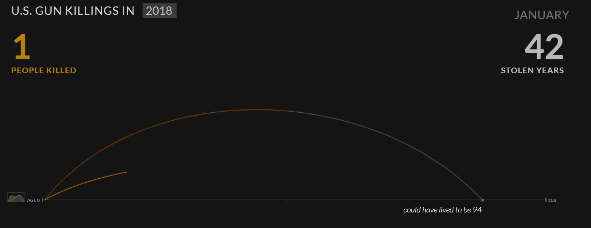


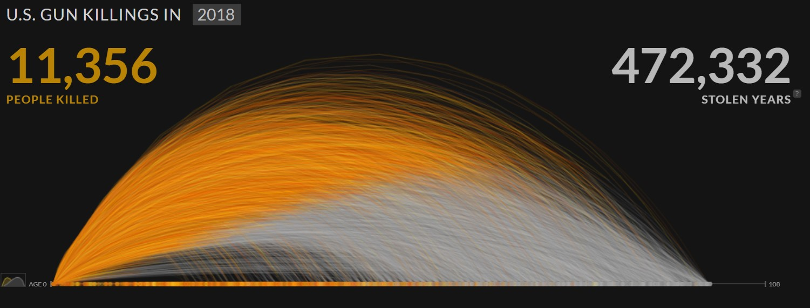


### US Unemployment

In the below charts, the New York Times embraces pluralism for Republican and Democrat interpretations of the same data.

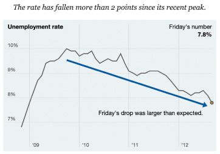
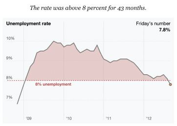

### Parental Leave

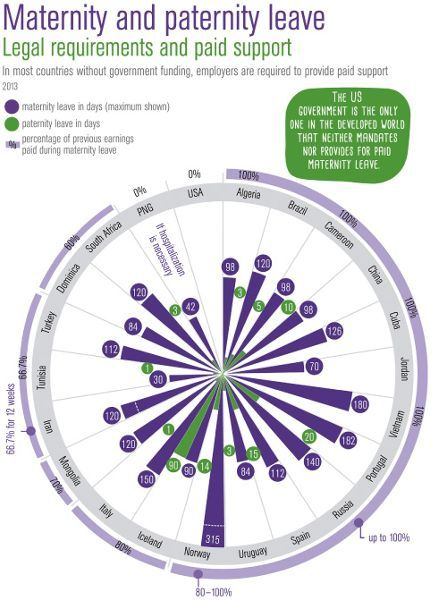

### Gendered clothes


### Gender Gap

To access the interactive visual, please follow the link to the [Telegraph.](https://www.telegraph.co.uk/women/business/women-mean-business-interactive/)

Scroll down the page until you reach the charts. Continue to scroll to proceed through the animations.

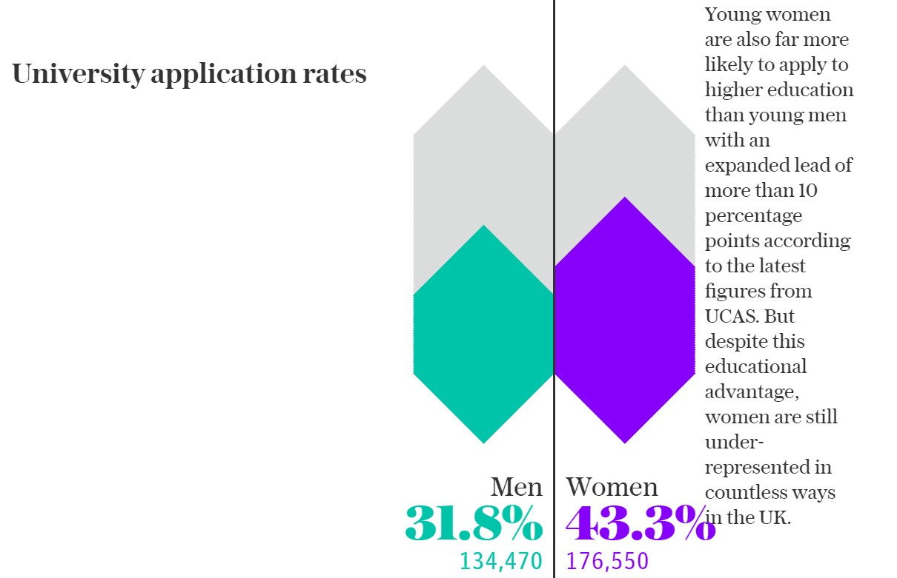

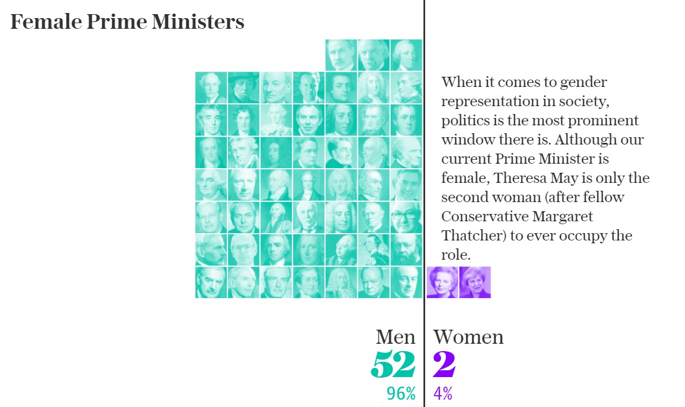

### US Congress

To view the interactive visualisation, please follow the link to the [US Guardian](https://www.theguardian.com/us-news/ng-interactive/2018/nov/15/new-congress-us-house-of-representatives-senate)

Select multiple filters to apply to the data as below.

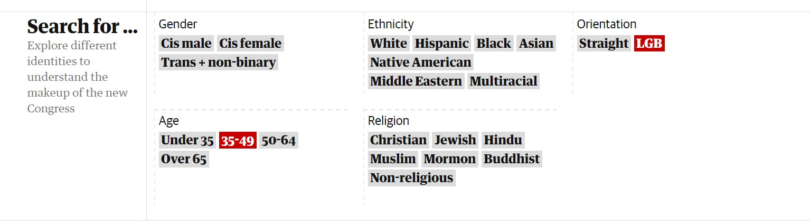

And observe the resultant hexmap.

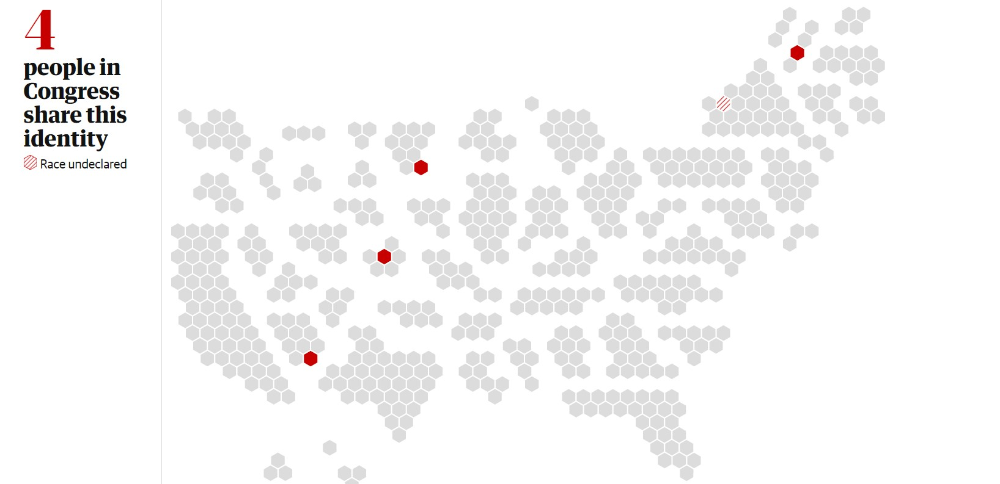


### Evictions

Please follow the link to the [anti eviction mapping project](http://www.antievictionmappingproject.net/narratives.html).

Hover over points for contextual tooltips.

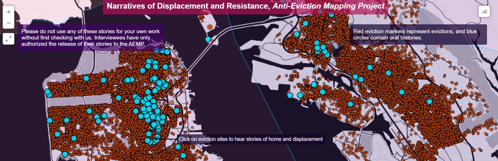

Click on a blue point for oral case study links on sound cloud.

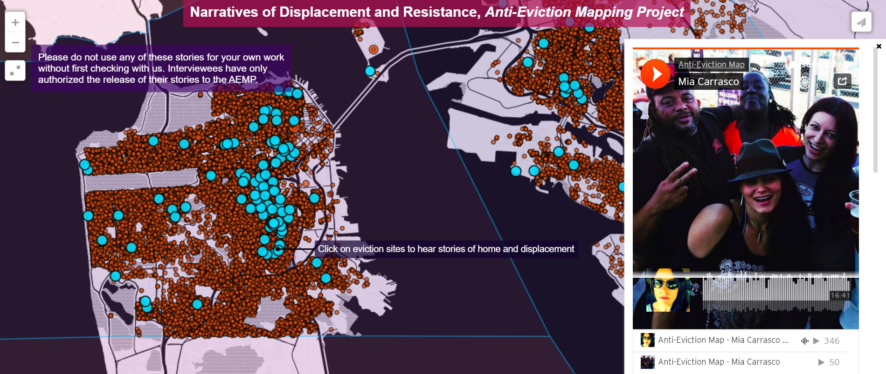

### Climate Change

To view the interactive visualisatoin, please follow the link to [Bloomberg.](https://www.bloomberg.com/graphics/2015-whats-warming-the-world/)

This site does a great job of "self declaration", adding context that reveal the authors' standpoint on anthropogenic climate change.

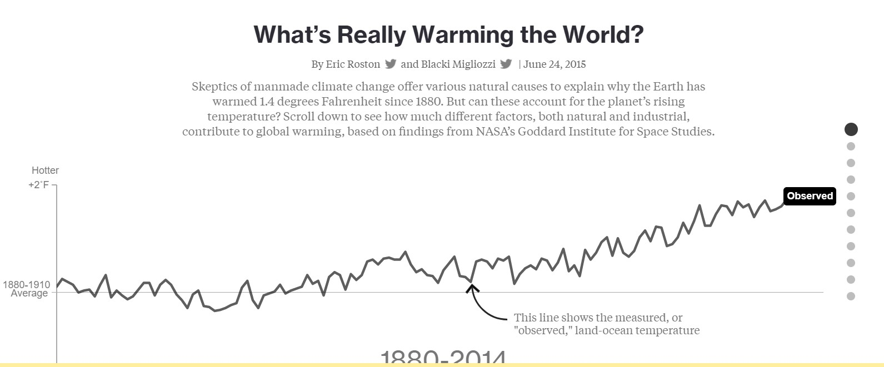

The visuals as shown in Data Feminism below, allocate 30 % of the total panel space to self-disclosure. 

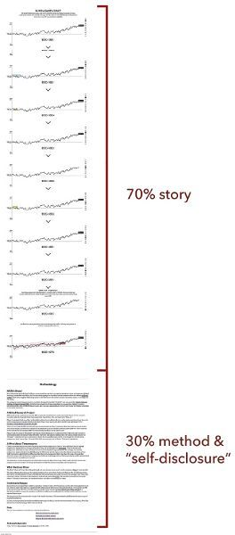


### Mental Health

A powerful reinterpretation of identical charts.

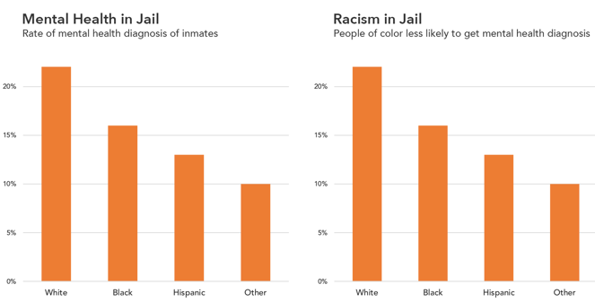

## {.unlisted .unnumbered .toc-ignore}

## Call to Action (Optional)

complete the data visualisations to a standard that you are happy with. If you have incorporated suggested improvements from other groups, please take the opportunity to acknowledge them. Consider sharing the visualisation on Twitter, along the lines of:

"Look how data feminist visualisation changed my chart...", tagging:  

#DataFeminism (camel case on this one)  
[\@kanarinka](https://twitter.com/kanarinka?lang=en)  
[\@laurenfklein](https://twitter.com/laurenfklein?ref_src=twsrc%5Egoogle%7Ctwcamp%5Eserp%7Ctwgr%5Eauthor)  
